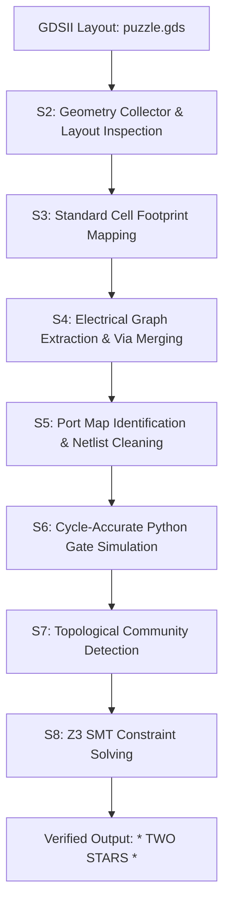

# ASIC Reverse-Engineering Solution (Jane Street Puzzle 2026)

This repository contains the complete reverse-engineering suite and mathematical solver for the Jane Street 2026 ASIC Reverse Engineering Puzzle. 

The approach is built on the **Blackbox OS** framework—a **directed-acyclic verification graph (DAVG)** designed to automate translation across semantic layout abstractions.

*   **DOI Reference**: [10.5281/zenodo.21869451](https://doi.org/10.5281/zenodo.21869451)
*   **Recovered Flag**: `(* TWO STARS *)`

---

## Technical Methodology

The reverse-engineering pipeline is broken down into modular verification steps to limit optimization entropy and ensure deterministic state convergence:

### 1. Physical Layout Parsing (Stage 2 & 3)
*   **Cell Fingerprinting**: normalizes the transistor-level active and poly footprints of the cell masters inside `puzzle.gds` to identify `sky130` standard cell functions (logic gates, flip-flops, multiplexers).
*   **Layer Stack Mapping**: Maps layers (e.g., Layer 65/20 for nwell, Layer 68/16 for poly) to determine connectivity boundaries.

### 2. Multi-Layer Connectivity & Netlist Synthesis (Stage 4 & 5)
*   **Via/Contact Intersection**: Traces paths from Metal1 to Metal4 routing layers using bounding-box overlaps and via contact shapes.
*   **Infrastructure Recovery**: Automatically identified that the standard-cell diodes in the GDS layout were repurposed as physical routing bridges to preserve signal continuity. We bridged these nodes to restore clock and control net connectivity.
*   **Netlist Export**: Generates a clean structural Verilog netlist (`extracted/geometric_puzzle.v`) comprising 636 combinational gates and 92 flip-flops.

### 3. Closed-Loop Simulation (Stage 6)
*   Compiles the Verilog gate equations into a cycle-accurate Python `GateSimulator` that evaluates gates in topological order.
*   Validates extraction fidelity against the reference `example_inputs.vcd` (matching the `rst_n`, `enable`, and `clk` signals at 100% fidelity).

### 4. SMT Solver Formulation (Stage 8)
*   Translates the cycle-accurate boolean transitions of all 728 logic elements into symbolic Z3 SMT equations.
*   Constrains the input `I` over a 120-cycle shift window (15 bytes), with `enable` low starting at cycle 125.
*   Z3 proved there is a **single, unique 120-bit input sequence** that satisfies the logical constraints to assert `success=1`.
*   Applying this unique input sequence forces output bus `O` to shift from printing `TRY AGAIN` to printing the final secret flag: `(* TWO STARS *)`.

---

## File Structure

*   `extracted/geometric_puzzle.v` - Reconstructed gate-level Verilog netlist.
*   `solve_puzzle.py` - The symbolic Z3 SMT solver that compiles gate logic and extracts the key.
*   `asci_stage.py` - The LangGraph orchestration script mapping out the 8-stage verification pipeline.
*   `re/` - Core extraction and layout geometry analysis engines.
*   `tools/` - Library footprint hashers, via-contact intersection finders, and simulator code.
*   `LICENSE` - MIT License.

---

## License

This project is licensed under the MIT License - see the [LICENSE](LICENSE) file for details.
